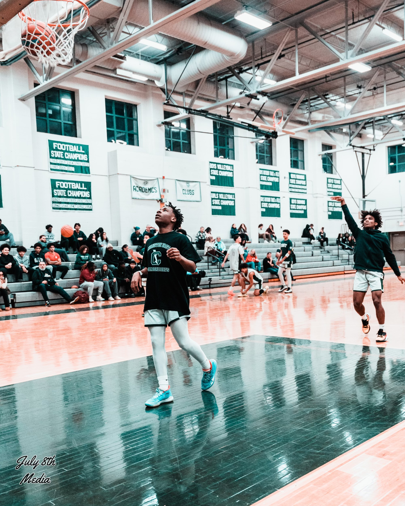

# About me 


<p id="p.">
    My name is <em>ENMANUEL</em> Morillo... not spelt with two "M's"
    I was born in the Dominican Republic and came here at the age of 7
    I speak both spanish and english fluently 
    When I was in high school I played basketball, football, and ran track and field 
    I come from a family of 5 and I'm the oldest out of 3. 
    </p>
   <ul>
   <li> I played basketball for <b> Cranston East </b>
   <li> Graduated with a 3.4 gpa 
   <li> Played football
   <li> Ran track as well... 

  </ul>


<figure> 
    
<style>
img {}


</style>


<script>
    // this section is javascript, not HTML evn though it's in the HTML file
    let slideIndex = 0;
    let slides = document.getElementsByClassName("slide");
    let slideTime = 20000;
    // var slideInterval = setInterval(showSlides, slideTime);
    // clearInterval(slideInterval);

    // if (slides.length > 0 ){
    //     showSlides();
    // }

    function showSlides() {
        let i;
        let slides = document.getElementsByClassName("slide");
        // console.log('in')
        // console.log(slides.length)
        // console.log(slideIndex)

        let dots = document.getElementsByClassName("dot");
        for (i = 0; i < slides.length; i++) {
            // console.log(i)
            // console.log('off')
            slides[i].style.display = "none";
        }
        slideIndex++;
        if (slideIndex > slides.length) { slideIndex = 1 }
        slides[slideIndex - 1].style.display = "block";
    }

    // show all again if not playing
    function showAll() {
        let i;
        let slides = document.getElementsByClassName("slide");

        for (i = 0; i < slides.length; i++) {
            slides[i].style.display = "block";
        }
    }

//  make full screen mode
    function openFullscreen() {
        var elem = document.getElementById('slideshow');
        console.log('fullscreen');
            if (elem.requestFullscreen) {
                elem.requestFullscreen();
            } else if (elem.mozRequestFullScreen) { /* Firefox */
                elem.mozRequestFullScreen();
            } else if (elem.webkitRequestFullscreen) { /* Chrome, Safari and Opera */
                elem.webkitRequestFullscreen();
            } else if (elem.msRequestFullscreen) { /* IE/Edge */
                elem.msRequestFullscreen();
            }
        showSlides()
        slideInterval = setInterval(showSlides, slideTime);
    }


    function closeFullscreen() {
            if (document.exitFullscreen) {
                document.exitFullscreen();
            } else if (document.mozCancelFullScreen) { /* Firefox */
                document.mozCancelFullScreen();
            } else if (document.webkitExitFullscreen) { /* Chrome, Safari and Opera */
                document.webkitExitFullscreen();
            } else if (document.msExitFullscreen) { /* IE/Edge */
                document.msExitFullscreen();
            }

        clearInterval(slideInterval);
        showAll();
        }

    // play without fullscreen
    function playSlideShow() {
        
            showSlides()
            slideInterval = setInterval(showSlides, slideTime);
        }

    function pauseSlideShow() {
        
            clearInterval(slideInterval);
            showAll();
        }
</script>
 
 <div id="slideshow">

```{include} _static/buttons.html
```


````{card-carousel} 3

```{card} 
:class-card: slide

```

```{card} 
:class-card: slide

```


```{card} 
:class-card: slide

```

```{card} 
:class-card: slide

```

```{card} 
:class-card: slide

```

```{card} 
:class-card: slide

```

```{card} 
:class-card: slide

```


```{card} 
:class-card: slide

```

```{card} 
:class-card: slide

```

```{card} 
:class-card: slide

```

```{card} 
:class-card: slide

```

```{card} 
:class-card: slide

```
```{card} 
:class-card: slide

```
```{card} 
:class-card: slide

```
```{card} 
:class-card: slide

```
```{card} 
:class-card: slide

```
```{card} 
:class-card: slide

```
```{card} 
:class-card: slide

```
```{card} 
:class-card: slide

```


````

</div>


