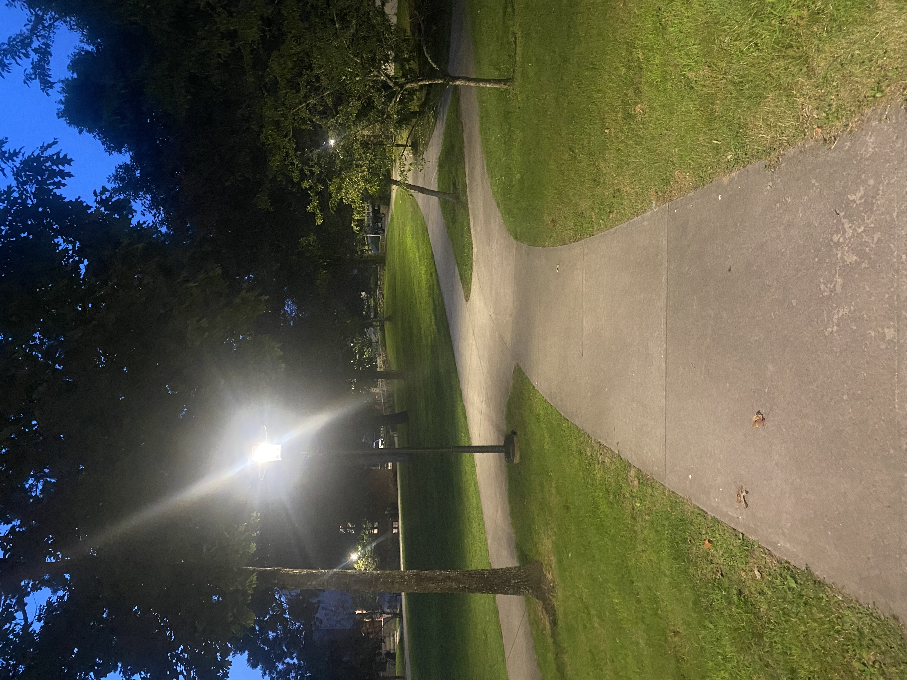
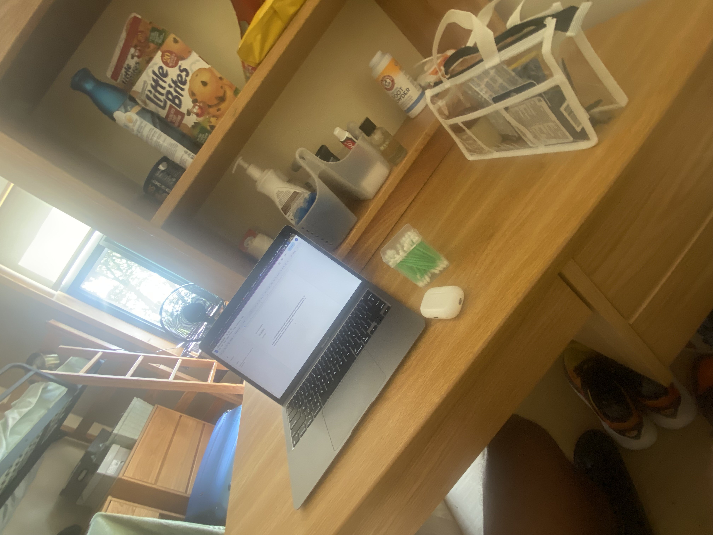

# Summer 2023 

<div id="slideshow">

```{include} _static/buttons.html
```


````{card-carousel} 3

```{card} 
:class-card: slide

```

```{card} 
:class-card: slide

```


```{card} 
:class-card: slide

```

```{card} 
:class-card: slide

```

```{card} 
:class-card: slide

```

```{card} 
:class-card: slide

```

```{card} 
:class-card: slide

```


```{card} 
:class-card: slide

```

```{card} 
:class-card: slide

```

```{card} 
:class-card: slide

```

```{card} 
:class-card: slide

```

```{card} 
:class-card: slide

```
```{card} 
:class-card: slide

```
```{card} 
:class-card: slide

```
```{card} 
:class-card: slide

```
```{card} 
:class-card: slide

```
```{card} 
:class-card: slide

```
```{card} 
:class-card: slide

```
```{card} 
:class-card: slide

```


````

</div>